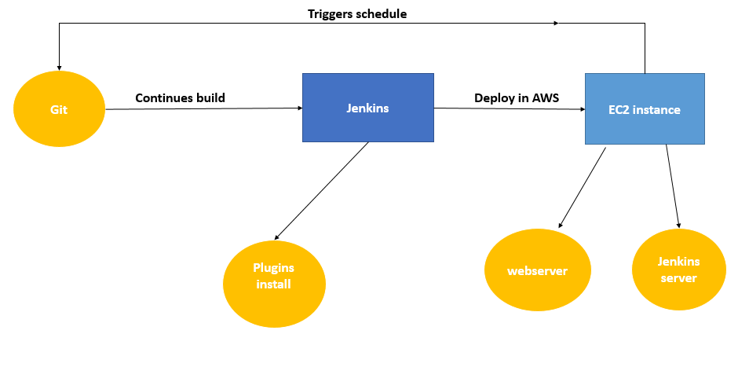
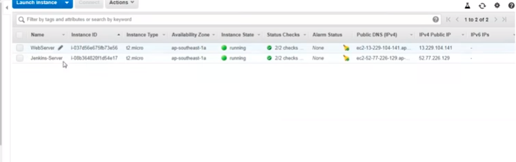

# Devops_Project
## company project

```
Requiremnt:
> Git install
> Jenkins
> AWS console

```

- Layout of Devops_Project



# Launch the Ec2 instances

> Steps to create EC2 instances:
- Choose an Amazon Machine Image (AMI):
- we recommend the Amazon Linux 2 AMI (free-tier eligible).     
Choose an instance type:
-we recommend the t2.micro (free-tier eligible).        
- Security group: you have the option to configure your virtual firewall.                           
- Launch instance: review your instance configuration and choose "Launch".       
-Create a key pair: Select "Create a new key pair" and assign a name. The key pair file (.pem) will download automatically - save this in a safe place as we will later use this file to log in to the instance. Finally, choose "Launch Instances" to complete the set up.



