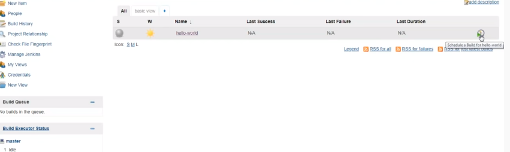

# Devops_Project
## company project

```
Requiremnt:
> Git install
> Jenkins
> AWS console

```

- Layout of Devops_Project


# Launch the EC2 instances

> Steps to create EC2 instances:
- Choose an Amazon Machine Image (AMI):
- we recommend the Amazon Linux 2 AMI (free-tier eligible).     
Choose an instance type:
-we recommend the t2.micro (free-tier eligible).        
- Security group: you have the option to configure your virtual firewall.                           
- Launch instance: review your instance configuration and choose "Launch".       
-Create a key pair: Select "Create a new key pair" and assign a name. The key pair file (.pem) will download automatically - save this in a safe place as we will later use this file to log in to the instance. Finally, choose "Launch Instances" to complete the set up.


- Install Jenkins in EC2 Jenkin server:

Steps to install Jenkins:
> First, we’ll add the repository key to the system.
- $ wget -q -O - https://pkg.jenkins.io/debian/jenkins-ci.org.key | sudo apt-key add -
-When the key is added, the system will return OK. Next, we’ll append the Debian package repository address to the server’s sources.list:
- $ echo deb https://pkg.jenkins.io/debian-stable binary/ | sudo tee /etc/apt/sources.list.d/jenkins.list
- $ sudo apt-get update
- $ sudo apt-get install jenkins
- Using systemctl we’ll start Jenkins:
- $ sudo systemctl start jenkins
- $  sudo systemctl status jenkins
- If everything went well, the beginning of the output should show that the service is active and configured to start at boot:
-  jenkins.service - LSB: Start Jenkins at boot time
  Loaded: loaded (/etc/init.d/jenkins; bad; vendor preset: enabled)
  Active:active (exited) since Thu 2017-04-20 16:51:13 UTC; 2min 7s ago
    Docs: man:systemd-sysv-generator(8)

Opening the Firewall

- $ sudo ufw allow 8080
- $ sudo ufw status
- $ sudo ufw allow OpenSSH
- $ sudo ufw enable

To set up our installation, we’ll visit Jenkins on its default port, 8080, using the server domain name or IP address: http://ip_address_or_domain_name:8080


***



***


***


***


***


***

```
$ cat server.xml
```
