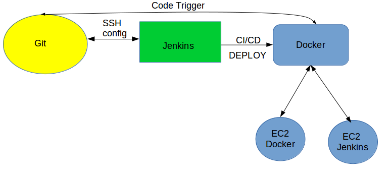
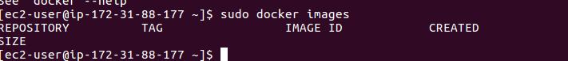
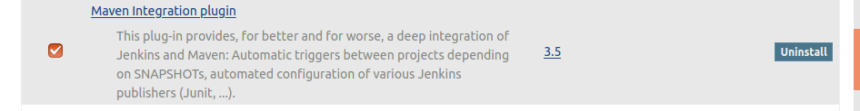
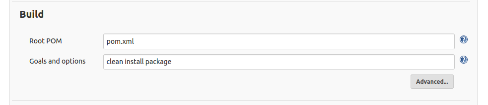
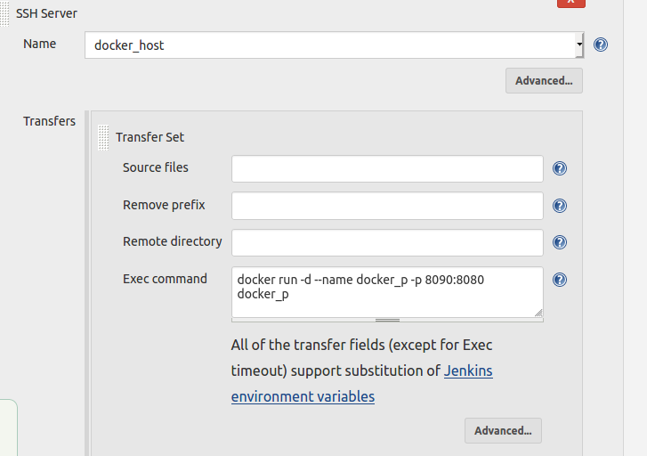
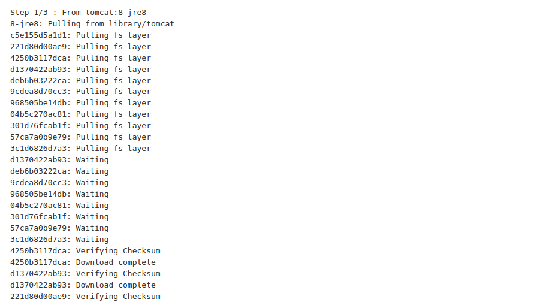
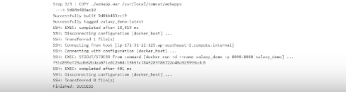
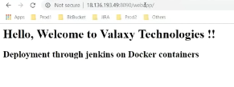
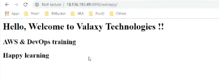

# Devops Project CI/CD To Docker
## Layout Project:

- Launch The EC2 instance
***

***

- Install Jenkins in EC2 webjenins

***

- Install docker in EC2 Docker

***

- create the dir.

***

- create dockerfile

***

- ADD Jenkins plugins ssh

***

***

- Add new jobs

***

- Add the creditions ssh

***

***

- Build jobs

 

 ***

***

***
- check the browser

***

