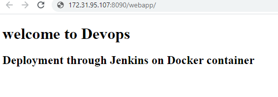

# Devops Project CI/CD Through Docker
## Layout Project:


***

- Launch The EC2 instance


***


- Install Jenkins in EC2 webjenins


***

- Install docker in EC2 Docker


***

- create the dir.
 - Assign permission

 ```
 $ chown -R dockeradimin:dockeradimin /opt/docker
```


  

***

- create dockerfile


***

- ADD Jenkins plugins ssh


***


***

- Add new jobs


***

- Add the credentials SSH


***


***

- Build jobs

 

 ***


***


***
- check the browser



***


***
