# Devops Project CI/CD To Docker
## Layout Project:

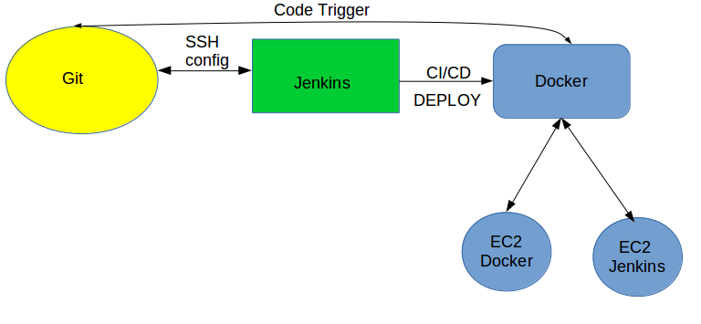

- Launch The EC2 instance
***

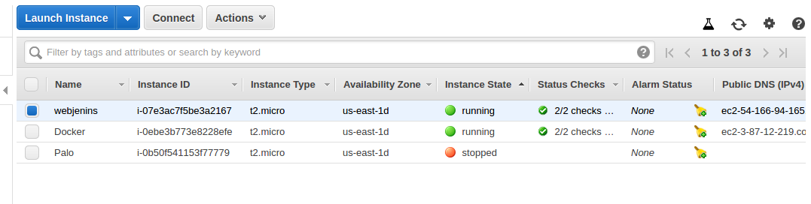

***

- Install Jenkins in EC2 webjenins

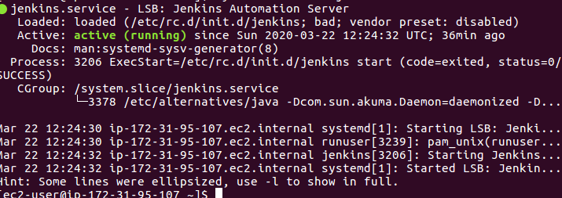

***

- Install docker in EC2 Docker

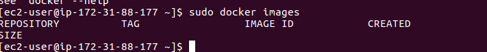

***

- create the dir.

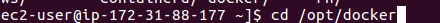

***

- create dockerfile

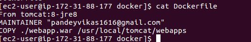

***

- ADD Jenkins plugins ssh

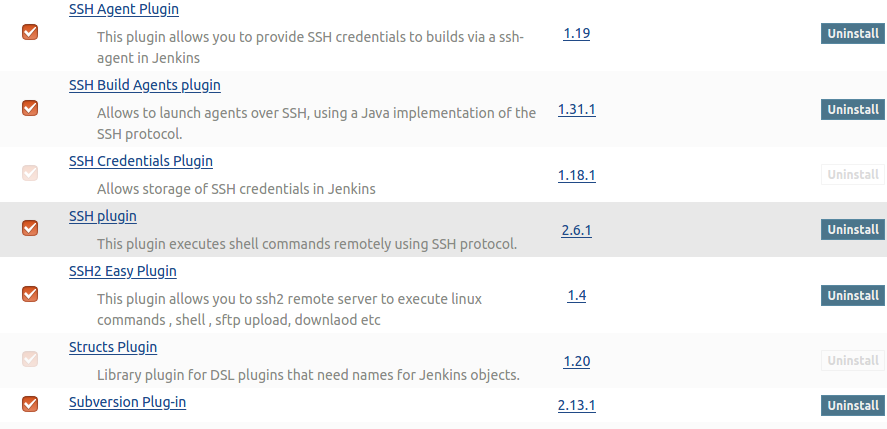

***

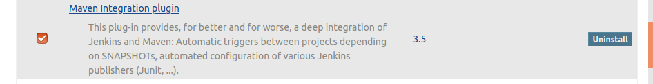

***

- Add new jobs

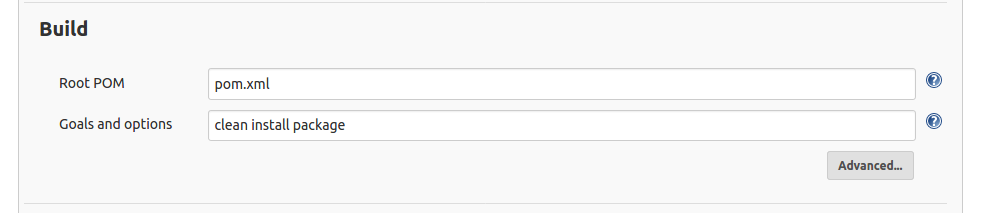

***

- Add the creditions ssh

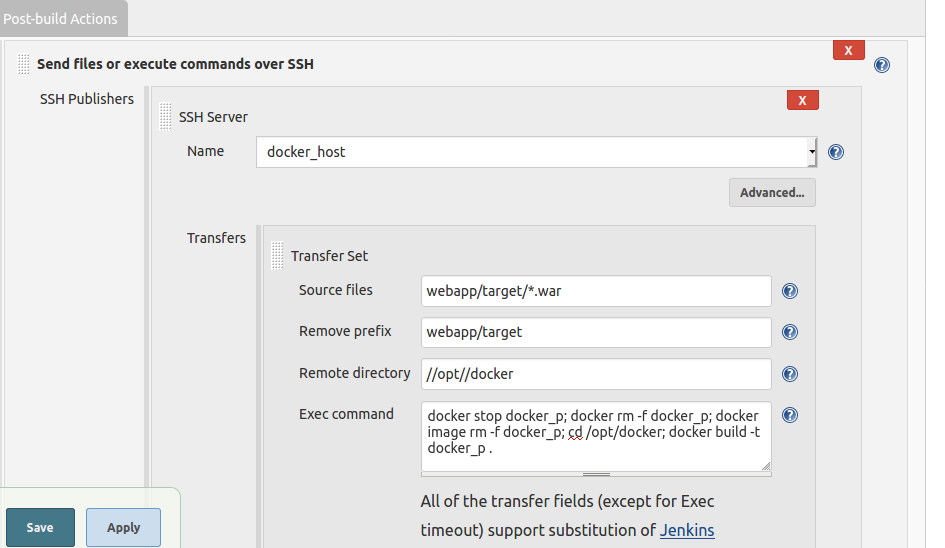

***

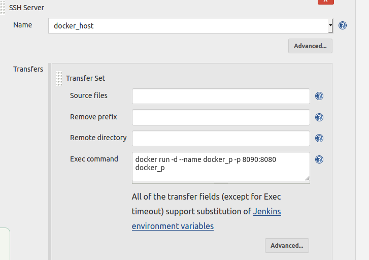

***

- Build jobs

 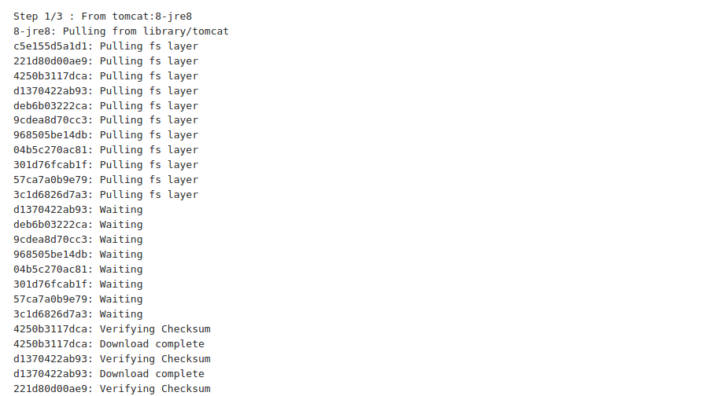

 ***

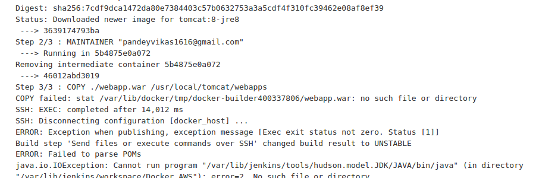

***

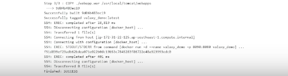

***
- check the browser

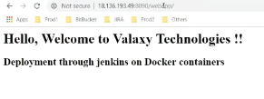

***

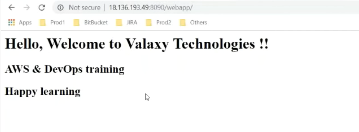
